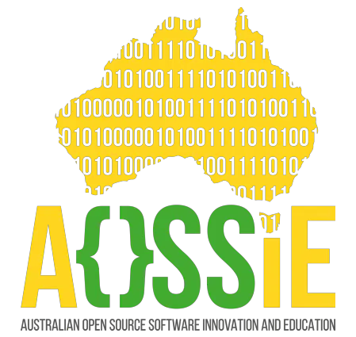

<!-- Don't delete it -->

<!-- Organization Logo -->

  
  

&nbsp;

<!-- Organization Name -->

<!-- Organization/Project Social Handles -->

<!-- Telegram -->

&nbsp;&nbsp;
<!-- X (formerly Twitter) -->

&nbsp;&nbsp;
<!-- Discord -->

&nbsp;&nbsp;
<!-- Medium -->

&nbsp;&nbsp;
<!-- LinkedIn -->

&nbsp;&nbsp;
<!-- Youtube -->

---

<h1>✦ AI Keyboard</h1>

<strong>Type less. Express more.</strong>

AI Keyboard is an open-source AI-powered mobile keyboard for Android and iOS. It automatically fixes grammar, translates, rewrites and improves your messages — all on your device. No cloud. No data collection. 100% private.

---

## 🚀 Features

- **Auto Grammar Fix**: Automatically fixes grammar and spelling as you type
- **Live Translation**: Translates Hinglish ↔ English and 50+ languages in real time
- **Improve Tone**: Adjusts the tone of your message to match your intent
- **Professional Rewrite**: Makes your text clear and professional instantly
- **Smart Reply**: Suggests quick contextual replies
- **Voice AI Typing**: Smart voice input with automatic punctuation
- **Smarter Autocorrect**: Understands multilingual typing without fighting you
- **AI Pipeline**: You control the order in which AI processes your text

All features are toggle-based. Turn a feature on, type normally, tap send — AI handles the rest. No extra steps. No popups. Maximum efficiency.

---

## 💻 Tech Stack

### Mobile App
- Flutter / Dart (companion app)
- Kotlin (Android keyboard)
- Swift (iOS keyboard)

### AI/ML
- On-device models only — no API keys, no cloud
- ML Kit (translation and language detection)
- Model selection in progress

---

## ✅ Project Checklist

- [ ] **The mobile app**:
   - [ ] Has an _About_ page containing AOSSIE's logo
   - [ ] Is available for download as a release in this repo
   - [ ] Is available in the relevant app stores
- [ ] **The AI/ML components**:
   - [ ] LLM/model selection and configuration are documented
   - [ ] Prompts and system instructions are version-controlled
   - [ ] Content safety mechanisms are implemented
   - [ ] All processing happens on-device — no API keys required

---

## 🔗 Repository Links

1. [Main Repository](https://github.com/AOSSIE-Org/AI-Keyboard)

---

## 🏗️ Architecture Diagram

Coming soon.

---

## 🔄 User Flow

Coming soon.

---

## 🍀 Getting Started

Coming soon. Architecture and setup guide will be added once the initial build is complete.

---

## 📱 UI Screens

**Keyboard UI**

**Companion App**

Full designs → [Figma](https://www.figma.com/design/UIR2HswyoRBGrWoD3QXmUg/ai-keyboard-designe)

---

## 🙌 Contributing

⭐ Don't forget to star this repository if you find it useful! ⭐

Thank you for considering contributing to AI Keyboard! Contributions are highly appreciated and welcomed. To ensure smooth collaboration, please refer to our [Contribution Guidelines](./CONTRIBUTING.md).

---

## ✨ Maintainers

- [Bhavik](https://github.com/bhav-07) — Project Lead
- [Bruno Zahnentferner](https://github.com/oliverbz) — Mentor

---

## 📍 License

This project is licensed under the MIT License.
See the [LICENSE](LICENSE) file for details.

---

## 💪 Thanks To All Contributors

Thanks a lot for spending your time helping AI Keyboard grow. Keep rocking 🥂

© 2025 AOSSIE